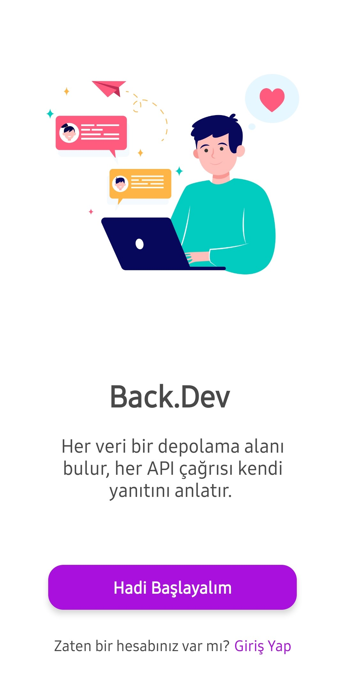
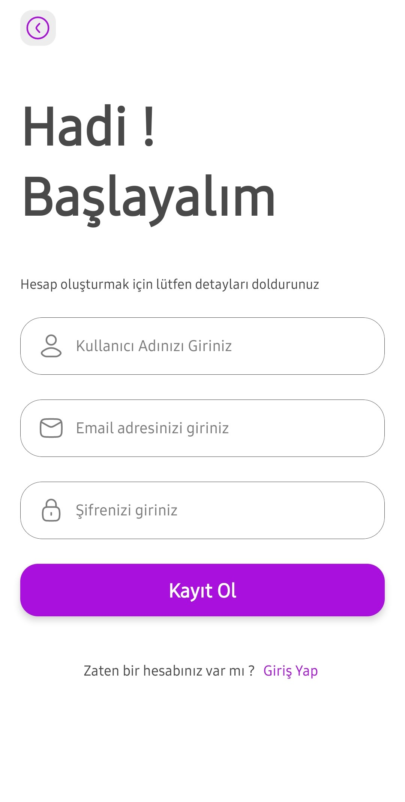
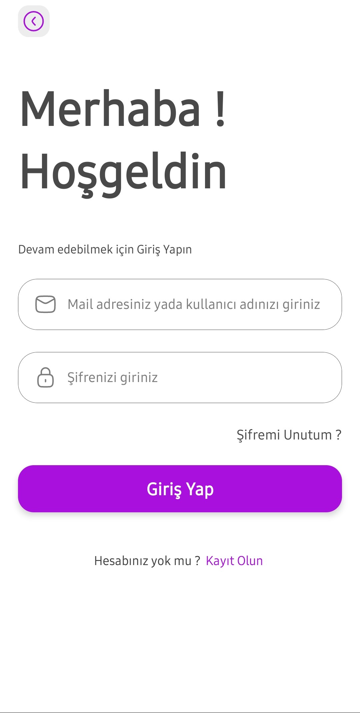
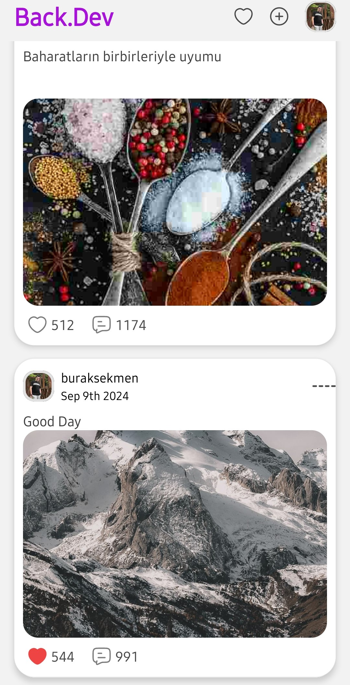

# SocialApp.MvcBackEnd

SocialApp.MvcBackEnd, .NET Core teknolojileri kullanılarak geliştirilen bir backend projesidir. Proje, **Onion Architecture**, **CQRS (Command Query Responsibility Segregation)** ve **MediatR** gibi modern yazılım mimarilerini içermektedir. Ayrıca, bu backend servisi bir **React Native** frontend uygulaması ile entegre çalışmaktadır.

## Proje Özellikleri

- **Onion Architecture**: Modüler ve katmanlı bir mimari yapı sunar, bağımlılıkların doğru şekilde yönetilmesine olanak tanır.
- **CQRS Pattern**: Veritabanı işlemlerini (komut ve sorgular) ayırarak daha ölçeklenebilir bir yapı sağlar.
- **MediatR**: İş mantığını ve veri iletimi sürecini kolaylaştıran bir tasarım deseni olarak kullanılmıştır.
- **Entity Framework Core**: Veritabanı işlemleri için kullanılan ORM aracıdır.
- **MySQL**: Veritabanı olarak MySQL kullanılmıştır.
- **RabbitMQ**: Mesajlaşma altyapısı için RabbitMQ kullanılmaktadır.

## Kullanılan Teknolojiler

- **.NET Core**: Backend API'nin oluşturulmasında kullanılmıştır.
- **Entity Framework Core**: Veritabanı işlemleri için kullanılır.
- **CQRS ve MediatR**: Sorgu ve komutların yönetilmesi için kullanılmıştır.
- **MySQL**: Projede kullanılan veritabanı teknolojisi.
- **RabbitMQ**: Mesajlaşma ve iletişim altyapısı için kullanılmıştır.

## Kurulum

Projenin çalıştırılması için gerekli adımlar şu şekildedir:

1. **Proje klonlama**: 
    ```bash
    git clone https://github.com/BurakSekmenn/backDev.git
    ```

2. **Bağımlılıkları yükleme**:
    ```bash
    cd SocialApp.MvcBackEnd
    dotnet restore
    ```

3. **Veritabanı ayarları**: `appsettings.json` dosyasındaki MySQL bağlantı ayarlarını kendi ortamınıza göre düzenleyin.

4. **Veritabanı migrasyon işlemi**:
    ```bash
    dotnet ef database update
    ```

5. **Projenin çalıştırılması**:
    ```bash
    dotnet run
    ```

## Ekran Görüntüleri

**React Native** ile geliştirilen frontend uygulamasına ait ekran görüntüleri;





---

## About

Bu proje, bir sosyal medya uygulamasının backend kısmını oluşturmak için geliştirilmiştir. **SocialApp.MvcBackEnd**, modern yazılım mimarileri olan **Onion Architecture**, **CQRS** ve **MediatR** kullanılarak tasarlanmıştır. Proje, kullanıcıların içerik oluşturmasına, paylaşmasına ve diğer kullanıcılarla etkileşim kurmasına olanak tanıyan bir sosyal platformun backend'ini sağlar. Bu backend, **React Native** ile geliştirilen mobil uygulamayla entegre çalışarak uçtan uca bir çözüm sunar.
